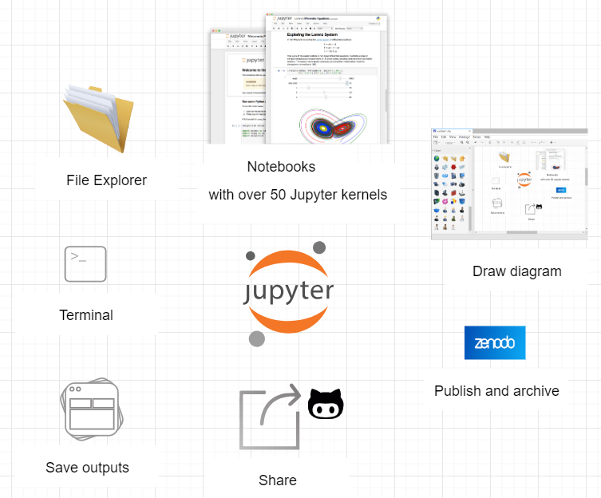

---
redirect_from:
  - "jupyter-publish-1"
interact_link: content/C:\Users\annefou\Documents\Github\coderefinery\osip-book\jupyter_publish_osip\content\jupyter_publish-1.ipynb
kernel_name: python3
has_widgets: false
title: 'Jupyter Publish-1'
prev_page:
  url: /introduction.html
  title: 'Introduction'
next_page:
  url: /jupyter_publish-2.html
  title: 'Jupyter Publish-2'
comment: "***PROGRAMMATICALLY GENERATED, DO NOT EDIT. SEE ORIGINAL FILES IN /content***"
---
# 1 - Introduction to JupyterLab

## What is Jupyterlab?

[JupyterLab](https://jupyterlab.readthedocs.io/en/stable/getting_started/overview.html) is the next-generation web-based user interface for [Project Jupyter](https://jupyter.org/). It is made of modular building blocks:

- File explorer
- Text editor
- Diagram generator
- jupyter notebooks supporting more than 50 different Jupyter kernels
- Terminals
- Outputs

with an easy integration with Jupyterlab extension such as [jupyterlab-latex](https://github.com/jupyterlab/jupyterlab-latex) for live-editing of LaTeX documents, [jupyterlab-git](https://github.com/jupyterlab/jupyterlab-git) and [jupyterlab-nbdime](https://nbdime.readthedocs.io/en/latest/extensions.html) for git integration or [jupyterlab-drawio](https://github.com/QuantStack/jupyterlab-drawio) for creating diagrams.

See [JupyterLab slides](https://github.com/jupyterlab/jupyterlab-demo/blob/master/slides/jupyterlab-slides.pdf) from [JupyterLab Github demo repository](https://github.com/jupyterlab/jupyterlab-demo) for more information about JupyterLab. 

## Get familiar with Jupyterlab

Make sure you have followed [setup instructions](setup.ipynb) and start jupyterlab:

You can also run the [JupyterLab demo](https://github.com/jupyterlab/jupyterlab-demo) with [Binder](https://mybinder.org/v2/gh/jupyterlab/jupyterlab-demo/master?urlpath=lab/tree/demo/Lorenz.ipynb).

