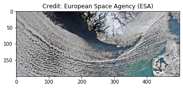
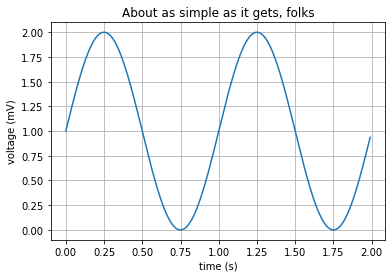

---
redirect_from:
  - "/jupyter-publish-2"
interact_link: content/C:\Users\annefou\Documents\GitHub\coderefinery\osip-book\jupyter_publish_osip\content\jupyter_publish-2.ipynb
kernel_name: python3
has_widgets: false
title: 'A first notebook to get familiar with JupyterLab'
prev_page:
  url: /jupyter_publish-1.html
  title: 'Introduction to JupyterLab'
next_page:
  url: /jupyter_publish-3.html
  title: 'JupyterLab git extension'
comment: "***PROGRAMMATICALLY GENERATED, DO NOT EDIT. SEE ORIGINAL FILES IN /content***"
---
# Skagerrak Strait - 21 March 2013

Another Envisat image \ref{fig:example}, acquired 31 January 2012, shows the Skagerrak Strait, which divides Norway and Denmark in 
this image. Clouds cover the North Sea and sweep down to the strait between Denmark (lower-right corner) and Norway 
(upper-centre) in this view.


<div markdown="1" class="cell code_cell">
<div class="input_area" markdown="1">
```python
from skimage import io
import matplotlib.pyplot as plt
%matplotlib inline

# https://images.eoportal.org/web/eoportal/images/snow-and-ice
url="https://images.eoportal.org/image/image_gallery?uuid=980fc01a-c2b5-43d1-a87c-1ce8c2d67763&groupId=163813&t=1363864717568"
image = io.imread(url)
plt.imshow(image)
plt.title("Credit: European Space Agency (ESA)")
plt.show()

```
</div>

<div class="output_wrapper" markdown="1">
<div class="output_subarea" markdown="1">

{:.output_png}


</div>
</div>
</div>


# Using equation with LaTeX notation in a markdown cell

The well known Pythagorean theorem $x^2 + y^2 = z^2$ was 
proved to be invalid for other exponents. 
Meaning the next equation has no integer solutions:

\begin{equation} \label{eq:1}
 x^n + y^n = z^n 
\end{equation}

The equation \ref{eq:1} can be referenced.


<div markdown="1" class="cell code_cell">
<div class="input_area" markdown="1">
```python
import matplotlib
import matplotlib.pyplot as plt
import numpy as np

# Data for plotting
t = np.arange(0.0, 2.0, 0.01)
s = 1 + np.sin(2 * np.pi * t)

fig, ax = plt.subplots()
ax.plot(t, s)

ax.set(xlabel='time (s)', ylabel='voltage (mV)',
       title='About as simple as it gets, folks')
ax.grid()

fig.savefig("test.png")
plt.show()

```
</div>

<div class="output_wrapper" markdown="1">
<div class="output_subarea" markdown="1">

{:.output_png}


</div>
</div>
</div>


Example above is taken from [https://matplotlib.org/gallery/lines_bars_and_markers/simple_plot.html](https://matplotlib.org/gallery/lines_bars_and_markers/simple_plot.html).

You can also add your own notebooks and try them out. Please note that your favourite python packages may not be available in the provided environment.


Then you can reference your figure (\cref{fig:example}).

