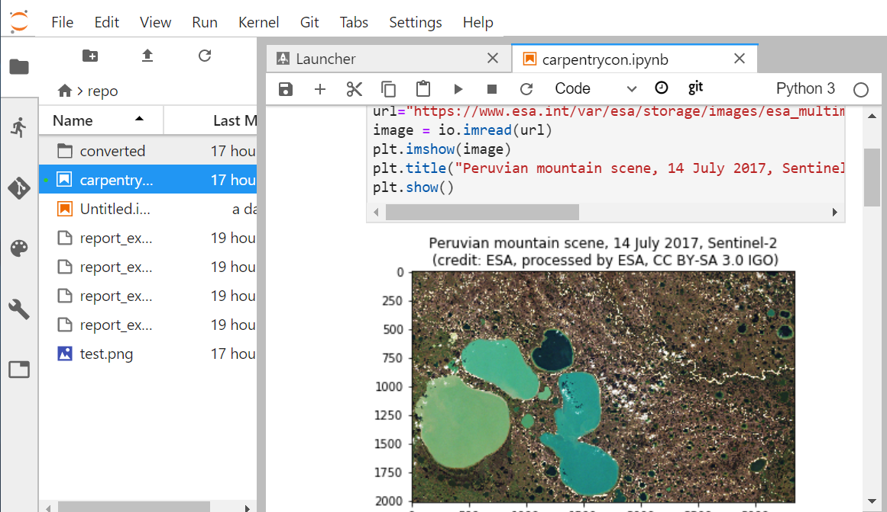
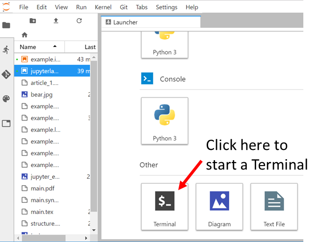
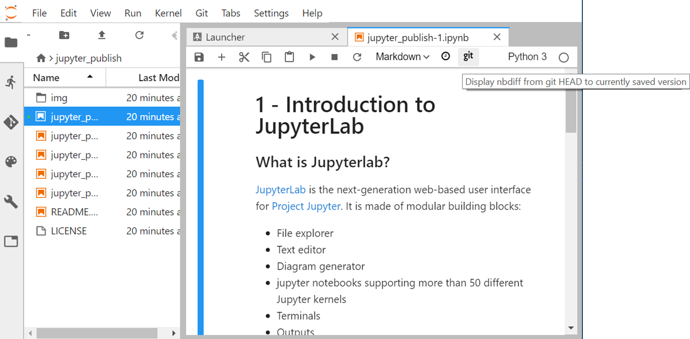
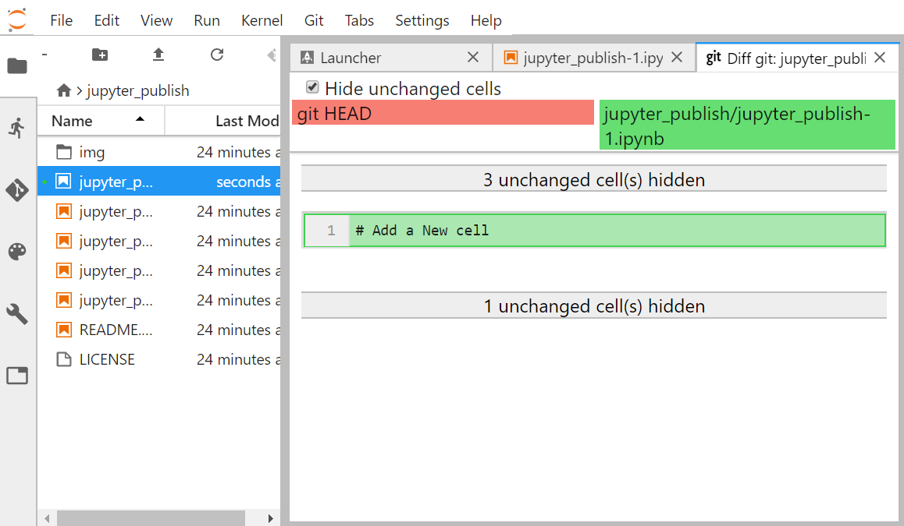
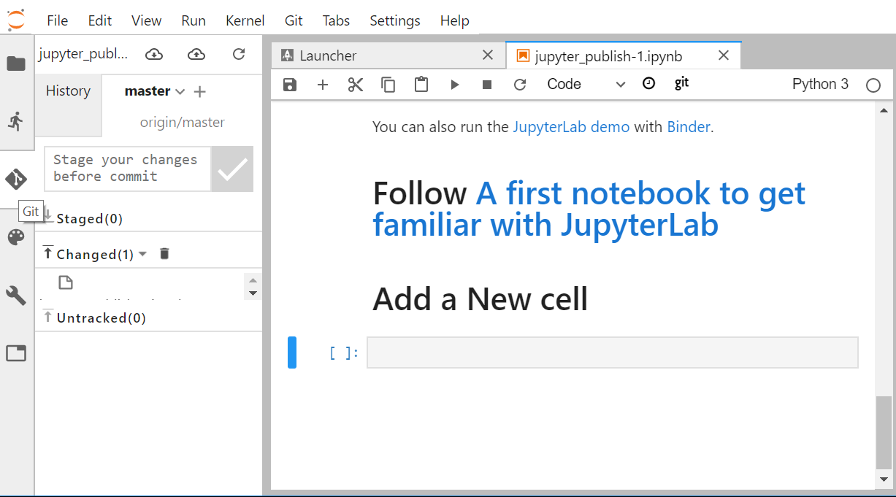

---
redirect_from:
  - "/jupyter-publish-3"
interact_link: content/C:\Users\annefou\Documents\GitHub\coderefinery\osip-book\jupyter_publish_osip\content\jupyter_publish-3.ipynb
kernel_name: python3
has_widgets: false
title: 'JupyterLab git extension'
prev_page:
  url: /jupyter_publish-2.html
  title: 'A first notebook to get familiar with JupyterLab'
next_page:
  url: /jupyter_publish-4.html
  title: 'Convert your notebook with ipypublish'
comment: "***PROGRAMMATICALLY GENERATED, DO NOT EDIT. SEE ORIGINAL FILES IN /content***"
---
# JupyterLab git extension


JupyterLab git extension is already installed in the Jupyter publish VM. If you want to install this extension to your local JupyterLab on your computer, follow installation instructions at [https://github.com/jupyterlab/jupyterlab-git](https://github.com/jupyterlab/jupyterlab-git).

## Check availability of JupyterLab git extension

A tab labeled “Git” (or with Git logo) as well as “Git panel” are available once JupyterLab git extension is properly installed, as shown on the figure below:





## Git Terminal

Save and close your Jupyter notebook so you can start a terminal from the JupyterLab Launcher:



From this terminal, you can use `git` as a command line:

```
git status
```

**Tips**

Another way to open a Git Terminal is to use the “Git” Tab -> “Open Terminal”
The copy/paste menu is “hidden” so to get it:
- copy: select the text to copy with your mouse then SHIFT and right-click with your mouse so the copy menu will appear.
- paste: SHIFT and right click to get the paste menu.


## Git diff Jupyter notebook

We have installed [nbdime](https://nbdime.readthedocs.io/en/latest/) and its JupyterLab extension so we can diff Jupyter notebooks:



Let's make a change in one of our jupyter notebook, for instance [jupyter_publish-1.ipynb](jupyter_publish-1.ipynb), by adding a new **markdown cell**:

```
# Add a new cell
```

Click on `git` to get the differences:




# Staging and committing from JupyterLab

You can either use `git` Terminal from JupyterLab and run the git command line to manage your project or you can use the graphical user interface provided by JupyterLab:



