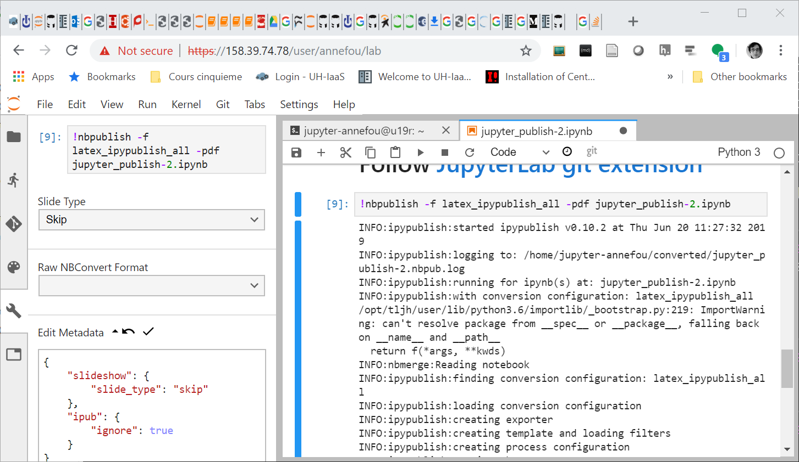
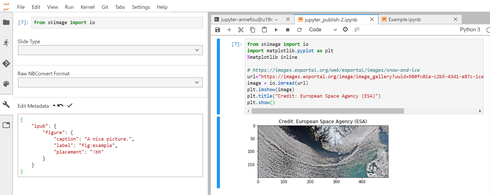

---
redirect_from:
  - "/jupyter-publish-4"
interact_link: content/C:\Users\annefou\Documents\GitHub\coderefinery\osip-book\jupyter_publish_osip\content\jupyter_publish-4.ipynb
kernel_name: python3
has_widgets: false
title: 'Convert your notebook with ipypublish'
prev_page:
  url: /jupyter_publish-3.html
  title: 'JupyterLab git extension'
next_page:
  url: /jupyter_publish-5.html
  title: 'Share and Publish Jupyter notebooks'
comment: "***PROGRAMMATICALLY GENERATED, DO NOT EDIT. SEE ORIGINAL FILES IN /content***"
---
# Convert your notebook with ipypublish

We have been using JupyterLab to keep our research work and are now ready to write a scientific paper associated with our computing results. We will be using [ipypublish](https://ipypublish.readthedocs.io/en/latest) to convert our notebook in various output formats. The main idea here is to have one source (that you can share in Github) that produces different kind of documents depending on the usage (oral presentation, paper publication, live demo, etc.).

### Generate publication ready documents from our jupyter notebooks

Being able to create live documents with JupyterLab is great because we can create a reproducible research work, share it and publish it, but we usually need to communicate our research work (oral presentation, paper publication, live demo, etc.).

Let’s go back to our jupyter notebook [jupyter_publish-2.ipynb](jupyter_publish-2.ipynb) and let’s create a nice LaTeX and pdf document from it.

Open a JupyterLab Terminal:

```
nbpublish -f latex_ipypublish_all -pdf jupyter_publish-2.ipynb
```

Execute this command and check `converted` directory. It should contain a list of files and in particular:
- jupyter_publish-2.tex
- jupyter_publish-2.pdf

`nbpublish` can be called directly from your jupyter notebook or from the jupyterLab Terminal.


### Customize outputs with metadata

#### Ignore outputs

It is sometimes convenient to inspect and modify metadata of a given cell. For instance, to ignore any cell for all outputs: 

```
{ 
   "ipub": {
    "ignore": true
  }
}
```



Do not forget to commit changes to git if you want them to remain!

#### Metadata for Figures

Each notebook cell can produce different kind of outputs and it is important to label your figure so you can reference them later in your notebook:

```
{
    "ipub": {
        "figure": {
            "caption": "A nice picture.",
            "label": "fig:example",
            "placement": "!bh"
        }
    }
}
```



Then you can reference your picture using latex notation:

```
Then you can reference your figure (\cref{fig:example}).
```


Generate again the pdf and you should see your figure listed in the list of figures and the reference to your figure with the right numbering.

**Metadata documentation**: to get more information on ipypublish metadata, look [here](https://ipypublish.readthedocs.io/en/latest/metadata_tags.html).


### Generate slides from our jupyter notebooks

Still using  [jupyter_publish-2.ipynb](jupyter_publish-2.ipynb), we can now generate a different output format, for instance for an oral presentation:

```
nbpublish -f slides_ipypublish_main jupyter_publish-2.ipynb
```

To view the resulting slides, go to the file explorer of JupyterLab and right click on the file to "Open in New Browser Tab".


As you can see many of the cell outputs do not appear by default in your slides. By default, an output that do not have metadata will not appear when producing slides!


**Tips**

If you are not running JupyterLab from a remote computer, you can also use `nbpresent`:

```
nbpresent converted/jupyter_publish-2.slides.html
```

## More on ipypublish

Please not that this would not be possible to visualize the resulting slides either from binder or jupyterhub. You would first need to download the resulting file on your local computer.

There are several options (not only `latex_ipypublish_all` or `slides_ipypublish_main`) to generate and customize what you would like to see in your report.

Check the [ipypublish documentation](https://ipypublish.readthedocs.io/en/lates) for more information. Please note that the ipypublish python package is still under development (beta version avaiable only).


### Additional ipypublish example

In this short tutorial, all the functionalities of ipypublish are not demonstrated. However, feel free to browse the [following example](https://github.com/annefou/ipypublish_example).


## Add generated files into your Github repository

If you want to keep your work, do not forget to add your changes to your Github repository either using JupyterLab git extension and/or JupyterLab Git Terminal.


