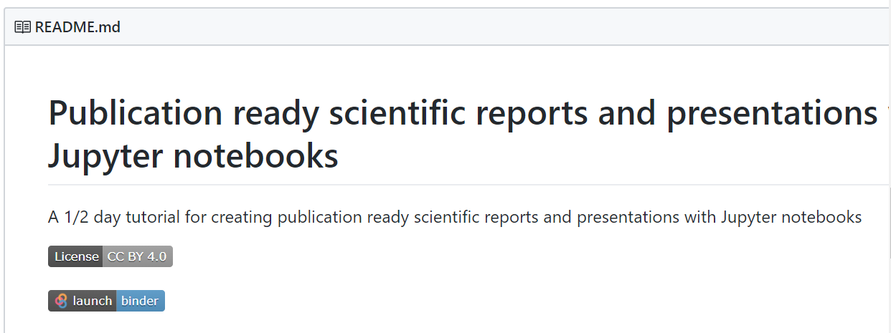
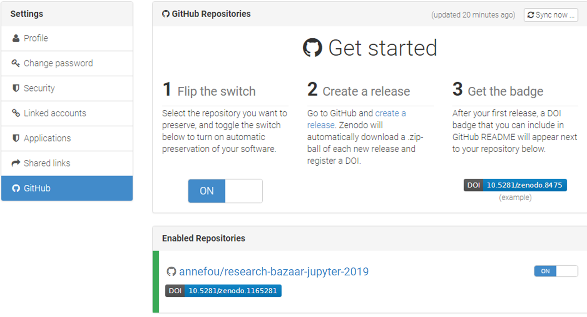

---
redirect_from:
  - "/jupyter-publish-5"
interact_link: content/C:\Users\annefou\Documents\GitHub\coderefinery\osip-book\jupyter_publish_osip\content\jupyter_publish-5.ipynb
kernel_name: python3
has_widgets: false
title: 'Share and Publish Jupyter notebooks'
prev_page:
  url: /jupyter_publish-4.html
  title: 'Convert your notebook with ipypublish'
next_page:
  url: https://github.com/coderefinery/jupyter_publish
  title: 'GitHub repository'
comment: "***PROGRAMMATICALLY GENERATED, DO NOT EDIT. SEE ORIGINAL FILES IN /content***"
---
# Share and publish your research work

To make publication ready scientific reports and presentations, we would need to share our research with [Github](https://github.com/) with an objective to be as reproducible as possible.

In this section we will learn how to publish our research work using [MyBinder](https://mybinder.org/) and [Zenodo](https://zenodo.org/).

Sharing your GitHub repository along with your jupyter notebooks and your publications is an important step for making your research reproducible. However, anyone willing to rerun your programs/notebooks need to get the same computational environment (python, LaTeX, additional python packages, etc.).

The next section (using [Binder](https://mybinder.readthedocs.io/en/latest/introduction.html)) will show you how to make your research “fully” reproducible, offering users the same computational environment as we used during this workshop and with very little extra efforts.

## MyBinder reproducible environment

### Important notice

*This lesson has been taken from [https://reproducible-science-curriculum.github.io/sharing-RR-Jupyter/](https://reproducible-science-curriculum.github.io/sharing-RR-Jupyter/) and is distributed under the <a href="https://creativecommons.org/licenses/by/4.0/">Creative Commons Attribution license</a>. The following is a human-readable summary of (and not a substitute for) the <a href="https://creativecommons.org/licenses/by/4.0/legalcode">full legal text of the CC BY 4.0 license</a>.*


### A short intro on Binder

Authors: Chris Holdgraf, M Pacer

[Slideshow](https://reproducible-science-curriculum.github.io/sharing-RR-Jupyter/slides/02-intro_to_binder.slides.html#/)

## Turn your github repository into a reproducible environment with [mybinder](https://mybinder.org/)

### Preparing your github repository for Binder

We would like to publish all the codes, notebooks, reports, etc. in our repository with Binder. To be Binder-compliant,
we need to add configurations files (one or more text files) that specify all the requirements for building your project’s.

All these configuration files are placed in a directory called binder that needs to be in the root directory of your git repository.

Check `binder` directory in your repository. We have already prepared all the necessary files for running in Binder:

```
ls binder
```

You should see 3 files:
- environment.yml  
- apt.txt         
- postBuild


#### Sharing our Python environment (environment.yml)

This approach is recommended when all the additional packages/libraries you need are part of conda. Be aware that `conda` is a source package management system and is not only used for `python`. Many packages/libraries, independent of python/R are made available via conda, so the best is to first check online whether your package is already available via conda.

```
name: jupyter-publish

channels:
  - conda-forge
  - bioconda
  - defaults

dependencies:
  - python=3.7
  - numpy >=1.14
  - scikit-image
  - nbdime
  - ipypublish
  - nbconvert
  - pip:
      - jupyterlab_latex
      - jupyterlab-git
```


This file must be placed in the binder directory of your reprository on Github (e.g. it needs to be added to your repository). From a JupyterLab Terminal (or using the JupyterLab Git GUI.

#### Additional system packages


Using environment.yml, we can run our jupyter notebooks but we cannot generate LaTeX and pdf documents as it is not available by default.

To share our computational environment, additional system packages (LaTeX, etc.) need to be installed.

When these packages are not available as `conda` packages, we install them with `apt-get install`.

- apt.txt : contains all the debian packages that should be installed for installing and compiling LaTeX documents. This file needs to be in `binder` directory too (same location as for `environment.yml`).

```
texlive-fonts-recommended
texlive-generic-recommended
latexmk
texlive-xetex
nano
vim
```


#### PostBuild

Sometimes, additional commands need to be run after installing all system and cond packages. For instance, in our case to activate git and LaTeX jupyterLab extension. For this purpose, we created a file called `PostBuild` (also in `binder` directory).

```
#!/bin/bash

jupyter labextension install @jupyterlab/git
pip install --upgrade jupyterlab-git
jupyter serverextension enable --py jupyterlab_git
nbdime extensions --enable

jupyter labextension install jupyterlab-drawio

jupyter labextension install jupyterlab-jupytext
pip install jupyterlab_latex
jupyter labextension install @jupyterlab/latex
```

#### Note

This file must be executable to be used with [repo2docker](https://repo2docker.readthedocs.io/en/latest/).

To do this, run the following on Linux/Mac-OSX from a JupyterLab Terminal:

```
chmod +x postBuild
```

On Windows (to be done before you commit your file) and from a JupyterLab Terminal:

```
git update-index --chmod=+x postBuild
```


### Launch your computational environment on Binder


- Start your complete computational environment on <a href="https://mybinder.org/">Binder</a>
- Try to execute your notebook
- Check your notebook can run in your Binder environment


### Get a shareable Binder Badge

- Create a shareable Binder link


To launch JupyterLab, you need to add `?urlpath=lab` after the branch name (here `master`) and to start from `index.ipynb`, add `index.ipynb` at the end:

https://mybinder.org/v2/gh/coderefinery/jupyter_publish/master?urlpath=lab/tree/index.ipynb

**In your case, replace coderefinery by your github username**.

- Update your README file in your github repository to display the shareable Binder badge with the proper github repository (yours and not the coderefinery one).





# Make your github repository citable with Zenodo


## Make your GitHub repository citable (<a href="https://en.wikipedia.org/wiki/Digital_object_identifier#">DOI</a>)

Your GitHub repository contains your scientific workflow, your programs/software, datasets (or links to your datasets) and jupyter dashboards so it is important to make the work you share on GitHub citable by archiving your GitHub repository to get a DOI. You may have a Data archive in your University or you may use the data archiving tool <a href="https://zenodo.org/">Zenodo</a>.

### Login to Zenodo

- Go to <a href="https://zenodo.org/">https://zenodo.org/</a> (or when testing only, you can use [https://sandbox.zenodo.org/](https://sandbox.zenodo.org/)) and click on `Log in` (not `Sign up`)
- Choose `Log in with GitHub`


- Zenodo will redirect you back to GitHub and ask you to give Zenodo the permissions it needs. click `Authorize Application`:


**Source**: <a href="https://guides.github.com/activities/citable-code/zenodo-authorize.png">https://guides.github.com/activities/citable-code/zenodo-authorize.png</a>

### Get a DOI for your Github repository

- When sucessfully login to Zenodo, click on your username (top right) and select `GitHub`


Then
- Select your repository `jupyter_publish` and flip the switch to `on`
- Create a <a href="https://help.github.com/articles/creating-releases/">Release on Github</a>
- Then go to your GitHub repository and click on `settings` and select `Webhooks`


Your GitHub repository is now linked to Zenodo and you will automatically get a DOI:




### Add your DOI to your GitHub repository

- Get your DOI badge on Zenodo and copy your DOI information (selection markdown)


- Go to your GitHub repository and edit your README file to add your DOI
- Create a new file CITATION in your GitHub repository and show how to cite your reprository with your DOI
 


