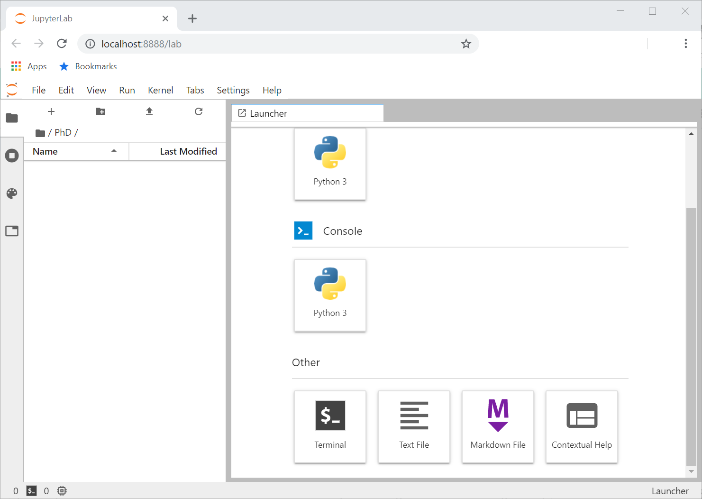
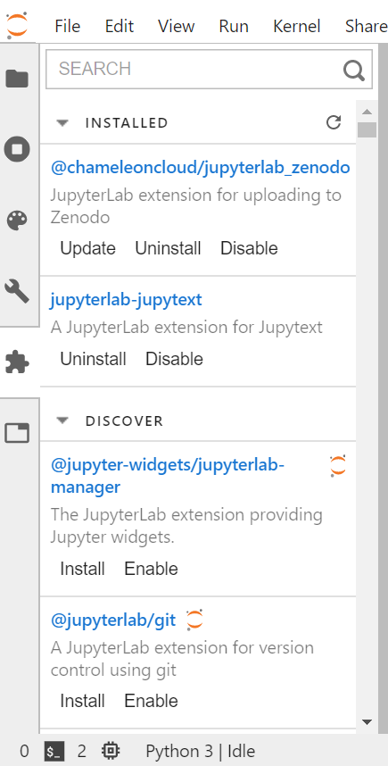

---
redirect_from:
  - "jupyterlab-intro"
interact_link: content/C:\Users\annefou\Documents\Github\coderefinery\osip-book\osip\content\jupyterlab_intro.ipynb
kernel_name: python3
has_widgets: false
title: 'JupyterLab as a framework for Open Science by Default'
prev_page:
  url: /introduction.html
  title: 'Introduction'
next_page:
  url: /write.html
  title: 'Publication ready scientific reports and presentations with Jupyter ecosystem'
comment: "***PROGRAMMATICALLY GENERATED, DO NOT EDIT. SEE ORIGINAL FILES IN /content***"
---
---
layout: episode

title: "JupyterLab as a framework for Open Science by Default"

teaching: 20

exercises: 25

questions:
  - "How can we use JupyterLab for Open Science by default?"
  - "What are JupyterLab extensions?"
  - "How can we extend JupyterLab?"
objectives:
  - "Learn to use JupyterLab for Open Science"
  - "Learn where to find JupyterLab extension"
  - "Learn how to create new JupyterLab extension"
keypoints:
  - "JupyterLab as a tool for all phases of research process."
--

 1 - Introduction to JupyterLab

## What is Jupyterlab?

[JupyterLab](https://jupyterlab.readthedocs.io/en/stable/getting_started/overview.html) is the next-generation web-based user interface for [Project Jupyter](https://jupyter.org/). It is made of modular building blocks:

- File explorer
- Text editor
- Diagram generator
- jupyter notebooks supporting more than 50 different Jupyter kernels
- Terminals
- Outputs

with an easy integration with Jupyterlab extension such as [jupyterlab-latex](https://github.com/jupyterlab/jupyterlab-latex) for live-editing of LaTeX documents, [jupyterlab-git](https://github.com/jupyterlab/jupyterlab-git) and [jupyterlab-nbdime](https://nbdime.readthedocs.io/en/latest/extensions.html) for git integration, [jupyterlab-drawio](https://github.com/QuantStack/jupyterlab-drawio) for creating diagrams and [jupyterlab-zenodo](https://pypi.org/project/jupyterlab-zenodo/) to easily publish research work and get proper [DOI](https://www.doi.org/).

See [JupyterLab slides](https://github.com/jupyterlab/jupyterlab-demo/blob/master/slides/jupyterlab-slides.pdf) from [JupyterLab Github demo repository](https://github.com/jupyterlab/jupyterlab-demo) for more information about JupyterLab. 

## Get familiar with Jupyterlab

Make sure you have JupyterLab installed and start it:

You can also run the [JupyterLab demo](https://github.com/jupyterlab/jupyterlab-demo) with [Binder](https://mybinder.org/v2/gh/jupyterlab/jupyterlab-demo/master?urlpath=lab/tree/demo/Lorenz.ipynb).

## JupyterLab extensions

The JupyterLab Graphical User Interface varies depending on the available kernels (`python`, `R`, `julia`, etc.) but also on the [JupyterLab extensions](https://jupyterlab.readthedocs.io/en/stable/user/extensions.html) you have installed.
And this is where JupyterLab differs from the "classical" Jupyter Notebooks.

> ## JupyterLab extension Manager
>
> Enable **Extension Manager**
> 
> **Figure:** The default view has three components: a search bar, an "Installed" section, and a "Discover" section.
>
{: .task}

Once enabled, you can see the list of extensions installed and update/uninstall/disable them. With **SEARCH**, you can find and install available extensions.

> ## Warning
> JupyterLab extensions make JupyterLab highly flexible and can really offer a fully customized user environment but 
> the following recommendations are **important**:
> - only install extensions you can trust (as it allows to execute arbitrary code on the server, kernel, and in the client’s browser)
> - some extensions may not be compatible with some versions of JupyterLab and may break it (as extensions are developed independently of JupyterLab).
>
{: .callout}

> ## Exercise
> Install a few extensions such as:
> - [jupyterlab-latex](https://github.com/jupyterlab/jupyterlab-latex) for live-editing of LaTeX documents, 
> - [jupyterlab-git](https://github.com/jupyterlab/jupyterlab-git) and [jupyterlab-nbdime](https://nbdime.readthedocs.io/en/latest/extensions.html) for git integration, 
> - [jupyterlab-zenodo](https://pypi.org/project/jupyterlab-zenodo/) to easily publish research work and get proper [DOI](https://www.doi.org/).
>
> > ## Solution
> > - Click on **DISCOVER** or type a word in **SEARCH** to find the corresponding extension 
> > - then click on **Install** to install and enable it. During the process, you may get a message such as *A build is needed to include the latest changes*: click on **Rebuild** to continue. At the end of the process, you will be asked to **Reload** the page which is the last step of the installation process.
> {: .solution}
{: .task}

Finally, as you probably already guessed, JupyterLab extensions can be developed independently of JupyterLab itself and anyone can create and distribute new extensions. You can find a step by step tutorial on [how to create a new extension](https://jupyterlab.readthedocs.io/en/stable/developer/extension_tutorial.html). However, before starting any new development, make sure you find out whether this extension already exist or not.

