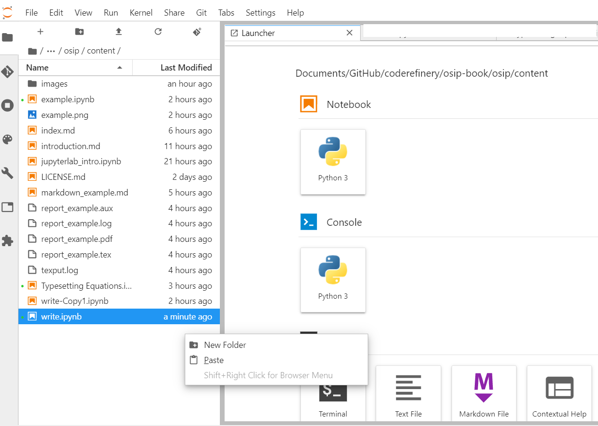
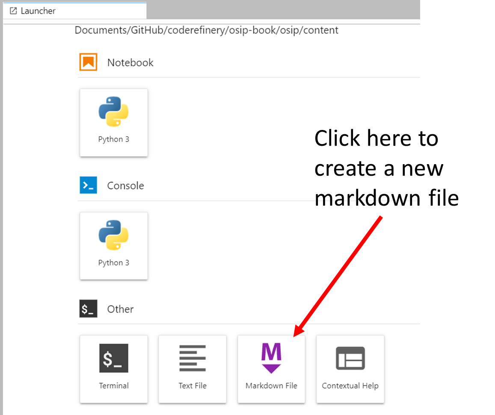
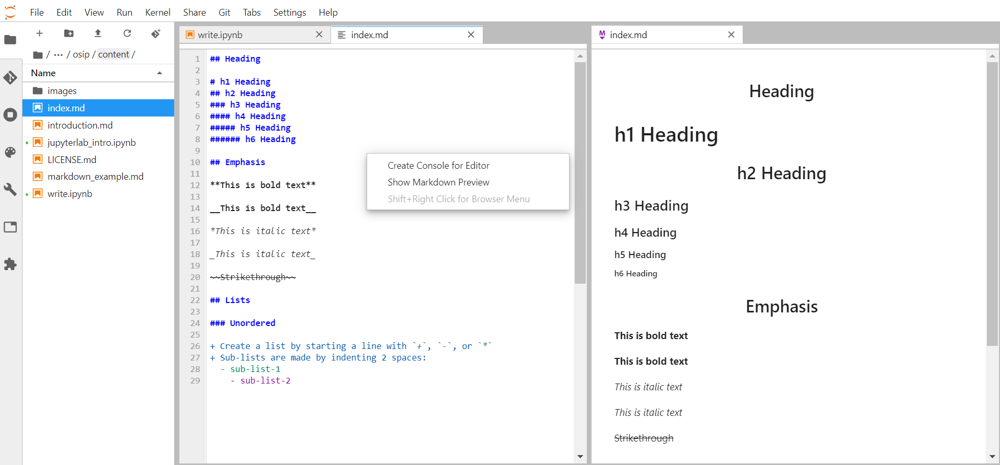
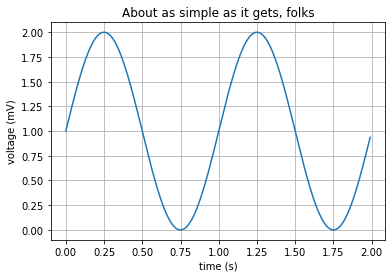
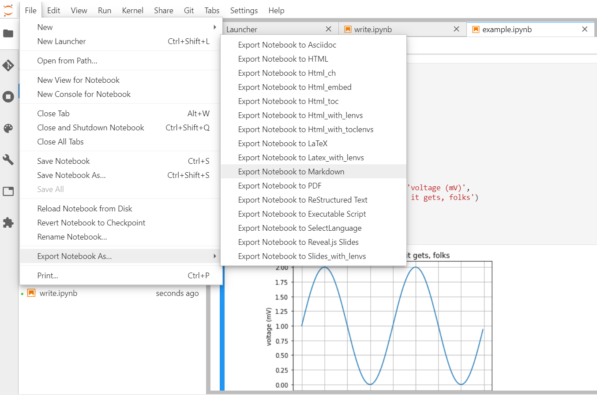
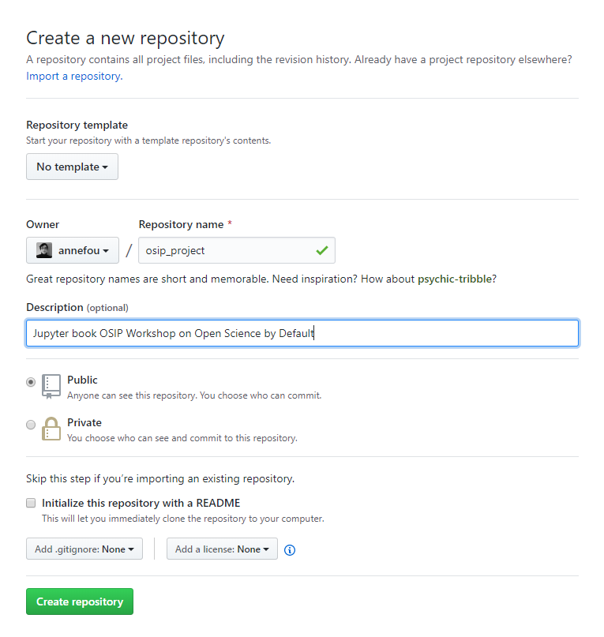
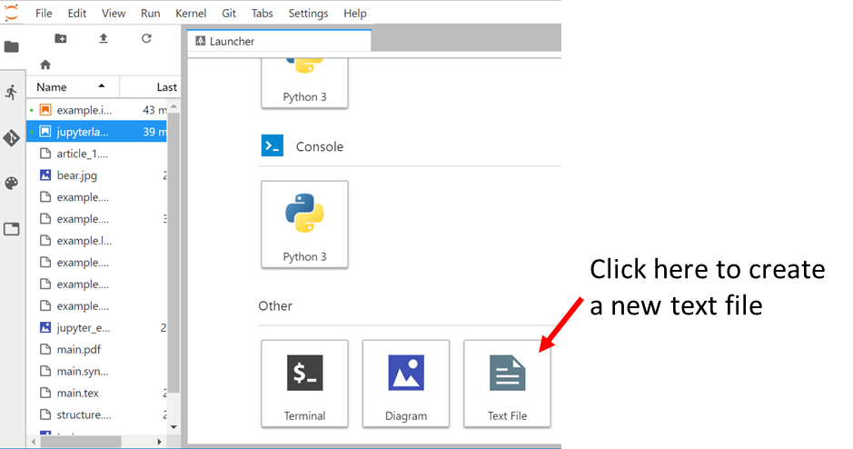
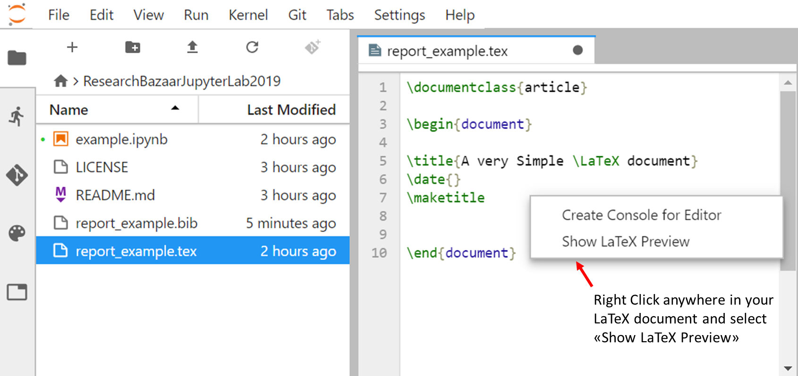
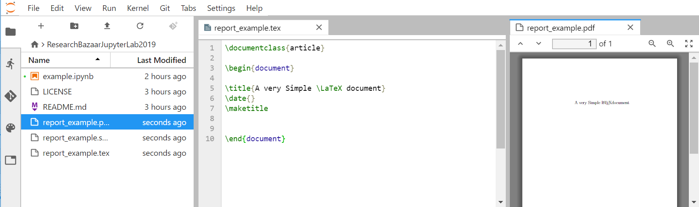

In this episode, we will learn how to generate different support to document/publish our research results. 

> ## Discussion (5mn)
> This discussion exercise is to be done in small groups (2-3 persons per group):
> - How do you document your research (inline with the code, jupyter notebooks, etc.)?
> - Where do you store your documents?
> - Do you share all your documents?
> - What tools/formats do you use (Word, LaTeX, Markdown, etc.)?
> 
{: .task}

JupyterLab can also be used to write and document your research to keep our research work. Let's have a quick overview of these possibilities.


# Start a new project

Let's imagine we have a new research idea (funded project or not) and have decided to make our research reproducible and share/ collaborate from the start of the project, following **Open Science** principles.

First step is to start our project and to keep it simple, we start creating a folder called `osbd_workshop` either from the command line:

```
# change directory to user HOME area
cd $HOME
# Create folder
mkdir osbd_workshop

# change directory to this newly created folder
cd osbd_workshop
```

or using JupyterLab File explorer (right click in the JupyterLab file explorer and select **New Folder**):



Then name it (`osbd_workshop`) and double click on its name to change directory.

> ## Tips
> One of the first thing we should think about when creating a new project is:
> - Create a README file to explain wht your project is about.
> - [Choose a license](https://choosealicense.com/)
> These need to be done at the very beginning, before you share anything. 
>
{: .callout}


# Live editing of Markdown documents

Create a new markdown file (make sure the file is created in `osbd_project`):



And rename it to *index.md*.

If you have an old version of JupyterLab, this **Markdown** icon may not be available; Then use the **Text** icon instead and rename your file (for instance *index.md*). Live editing of Mardkown documents is anyway available:

# Find short online guide for mastering markdown

Markdown language is often used to format readme files and these files are "nicely" rendered by [Github](https://github.com/).

## Where can I learn Markdown?

You already know a large part of markdown as the key aspect of the markdown language is that you can write plain text.

If you plan to use Markdown for commenting/publishing your research work on github, an online guide for [mastering markdonw](https://guides.github.com/features/mastering-markdown/)

Let's take an example (copy-paste in your newly markdown file):

~~~bash
## Heading

# h1 Heading
## h2 Heading
### h3 Heading
#### h4 Heading
##### h5 Heading
###### h6 Heading

## Emphasis

**This is bold text**

__This is bold text__

*This is italic text*

_This is italic text_

~~Strikethrough~~

## Lists

### Unordered

+ Create a list by starting a line with `+`, `-`, or `*`
+ Sub-lists are made by indenting 2 spaces:
  - sub-list-1
    - sub-list-2
~~~

To render it in Jupyterlab, right click and select **"Show Markdown Preview"**. Then the rendered page should appear as shown on the figure below:





> ## Create website on Github
> 
> Github gives you the opportunity to host webpages and for getting this functionality you need:
> - Create a new Github repository named `osbd_workshop` but do **NOT** initialize your repository (no license and no README)
> - [Set up git](https://swcarpentry.github.io/git-novice/02-setup/index.html) if you have not done it yet:
>
> ```bash
> git config --global user.name "Vlad Dracula"
> git config --global user.email "vlad@tran.sylvan.ia"
> git config --global core.autocrlf input
> ```
> Where you should put your own name and email!
>
> - Follow the instructions given online (after you created your empty repo) 
> and push your markdown files in a Github repository and make sure you name the main file `index.md`
> ```bash
>  git remote add origin https://github.com/USER/osbd_workshop.git
>  git push -u origin master
> ```
> **Always change USER by your github username**.
>  You will have to authenticate yourself to push your changes.
> - [Choose and add a licence](https://choosealicense.com/)
> - Enable Github pages for your repository:
> 
> Your website is now online at `http://USER.github.io/osbd_workshop` (Change **USER** to your github username)
> More information can be found [here](https://pages.github.com/)
>
{: .callout}


# Equations within Markdown documents

If you need to write equations, you can use [LaTeX mathematics](https://en.wikibooks.org/wiki/LaTeX/Mathematics) notations (work both for markdown files and jupyter notebook markdown cells):

```
$x^2 * x^2$
```

Would render: $x^2 * x^2$

You can find a few other examples at [Notebook motivating examples](https://jupyter-notebook.readthedocs.io/en/stable/examples/Notebook/Typesetting%20Equations.html). 

So if you are using LaTeX for the ease of writing equations, markdown language may be a good solution for you! We will learn more about [LaTeX](https://www.latex-project.org/) but for now we will learn to combine Mardown files and Jupyter Notebooks to create online "books".


# Create online Jupyter book

## Convert Jupyter notebooks to Markdown

Any Jupyter notebook can be converted to a simple markdown file. 

Let's create a new python jupyter notebook and rename it to `example.ipynb` (the same example could be done with any other available kernels) and make a plot (see [matplotlib gallery for examples](https://matplotlib.org/gallery.html)):


<div markdown="1" class="cell code_cell">
<div class="input_area" markdown="1">
```python
%matplotlib inline
import matplotlib
import matplotlib.pyplot as plt
import numpy as np

# Data for plotting
t = np.arange(0.0, 2.0, 0.01)
s = 1 + np.sin(2 * np.pi * t)

fig, ax = plt.subplots()
ax.plot(t, s)

ax.set(xlabel='time (s)', ylabel='voltage (mV)',
        title='About as simple as it gets, folks')
ax.grid()

fig.savefig("example.png")
plt.show()

```
</div>

<div class="output_wrapper" markdown="1">
<div class="output_subarea" markdown="1">

{:.output_png}


</div>
</div>
</div>


- Then browse the **File** menu and select **Export Notebook As...** and **Export Notebook to Markdown**.




An archive (zip/tarball) is created and contains all the converted files (one for the markdown and one file per image/pictures).

> ## Remarks
> - The utility [nbconvert](https://nbconvert.readthedocs.io/en/latest/) is used behind the scene. 
> - **Export Notebook As...** allows you to convert your notebook in different formats (HTML, LaTeX, pdf, etc.) but some of
> these options may need to be configured to work properly.
{: .callout}


Converting jupyter notebooks to markdown can be useful to create live documents on the web (for instance by pushing them on Github).

> ## Note
> Jupyter notebooks are rendered automatically by Github too without having to convert them to markdown.
> However, it makes it difficult when using jupyter widgets or any interactive notebooks.
>
{: .callout}


## Jupyter book

For a given research project, you could easily have several Jupyter notebooks and markdown files detailing your research workflow. To be usable, it is often necessary to give additional information at least for instance the order in which markdown files and jupyter notebooks need to be read (some kind of table of content / index file). [jupyter-book](https://jupyter.org/jupyter-book/intro.html) can be used to build an online book using a collection of Jupyter Notebooks and Markdown files.

In this section, we will be using `jupyter-book` to create an online book served by Github. We will follow the [online jupyter-book tutorial](https://jupyter.org/jupyter-book/guide/02_create.html).

`jupyter-book` command line is not available by default and needs to be installed with `pip`:

Open a Terminal and check the availability of `jupyter-book` (accessible from the Launcher):

```bash
jupyter-book --help
```

If you get an error message such as:
```
bash: jupyter-book: command not found
```

Then you need to install `jupyter-book`:

```bash
pip install jupyter-book
```

Once installed, we can start creating a new book:

- check the current working directory:

```bash
pwd
```
Move to the parent directory of `osbd_workshop` e.g. you should see `osbd_workshop` from the current directory:

```bash
ls osbd_workshop
```

If the command above returns an error, change the current directory; for instance:

```bash
cd $HOME
```

The command above assumes `osbd_workshop` folder has been created from your HOME folder. Then we create a new jupyter book (`osbd_workshop` contains all the files we would like to have in our book):


```bash
 jupyter-book create osip_project --content osbd_workshop
```

The command above returns:

```
Copying new book to: ./osip_project
Copying over your content folder...
TOC written to: ./osip_project/_data/toc.yml
Updating template configuration file with the values in /C/users/annefou/appdata/local/continuum/anaconda3/envs/osip2019/lib/site-packages/jupyter_book/minimal/_config.yml

================================================================================

Finished creating a new book at `./osip_project`
- Your content is in `./osip_project/content`

- A Table of Contents file is at `./osip_project/_data/toc.yml`.
  You should check its contents, make sure it references your
  content correctly, and ensure it has the correct order.

- Your configuration file is at `./osip_project/_config.yml`.
  You should check its contents and double-check that the values  are correct for your site.

Notes
=====
- Check your Table of Contents file (`_data/toc.yml`). Because you specified a content foler
  but no Table of Conents (`--toc`), we auto-generated a TOC file file using folder and file
  names. You should check its contents and clean it up so that it has the structure you want!

- We've added a CC-BY-SA license for you in ./osip_project/content/LICENSE.md
  This is a reasonable license for most book content, though feel free
  to change it if you like!

================================================================================
```

A new folder `osip_project` is created. It contains many files but we will first check the files listed by `jupyter-book` command:

- `osip_project/_data/toc.yml`
- `osip_project/_config.yml`

Please note that on Windows, you would see a baskslash character instead of a slash for folder separator.

> ## License
> A CC-BY-SA license has been automatically added in **osip_project\content\LICENSE.md** but feel free to update it.
>
{: .callout}

Now we will be working in our book so we will change directory to `osip_project`:

```bash
cd osip_project
```

Check the table of content **_data/toc.yml**:

- Files do not contain any extensions (neither `.ipynb` nor `.md`). 
- by default files are listed by alphabetical order (feel free to update it).

> ## Customize your book
> - Edit **_config.yml** and update the title, author and description
{: .task}

The content of your book is in the `content` folder. 
If you change any of the files in the `content` folder, you need to re-generate our new jupyter book:

```bash
jupyter-book build .
```

Your Jupyter Book is in `_build/` and we are now ready to publish it on github.

## Publish your book online with GitHub Pages

- Create a new git repository (make sure you are in `osip_project` folder):

```bash
git init
git add .
git commit -m "Publish my research project book"
```

- Create a new **empty** repository (name it `osip_project`) on Github (make sure you do not add any README or license file)- 



- Push your local repository to Github

```bash
>  git remote add origin https://github.com/USER/osip_project.git
>  git push -u origin master
```

> ## Warning
> Make sure you replace **USER** by your own github username.
>
{: .callout}

- Enable GitHub site building for your repository


Once enabled, your book is online and available at `https://USER.github.io/osip_project`.

> ## Warning
> - Make sure you replace `USER` by your own github username.
> - It may take a few minutes to get your book online.
>
{: .callout}

## Interact link settings (optional)

We have not fully configured our jupyter book yet, in particular to enable code interaction.

Edit `_config.yml` and update it:

- configure your repository:

```bash
baseurl: /osip         # the subpath of your site, e.g. /blog. If there is no subpath for your site, use an empty string ""
url: http://USER.github.io   # the base hostname & protocol for your site, e.g. http://example.com
```

**Make sure you replace USER by your own github username**.

- enable jupyterlab:

```bash
# General interact settings
use_jupyterlab: true 
```

- Configure binder

```bash
# Binder link settings
use_binder_button: true                 # If 'true', add a binder button for interactive links
binderhub_url: https://mybinder.org                        # The URL for your BinderHub. If no URL, use ""
binder_repo_base: https://github.com/                     # The site on which the textbook repository is hosted
binder_repo_org: USER                     # The username or organization that owns this repository
binder_repo_name: osip_project                        # The name of the repository on the web
binder_repo_branch: master                   # The branch on which your textbook is hosted.
binderhub_interact_text: Interact              # The text that interact buttons will contain.
```

**Make sure you replace USER by your own github username**.

Update `requirements.txt`:

```bash
numpy
matplotlib
```
- Enable [thebelab](https://thebelab.readthedocs.io/en/latest/):

```bash
# Thebelab settings
use_thebelab_button: true                # If 'true', display a button to allow in-page r
```

Then rebuild your jupyter book:

```bash
jupyter-book rebuild .
```

And push the modified files to github:

```bash
git add _config.yml
git commit -m "configure interact settings"
git push origin master
```


Then check again your jupyter book online and execute code part using either **Thebelab** or **Interact** buttons:


> ## Remark
>
> Instead of having a unique `requirements.txt` file for binder, you can create a new folder called `binder` (see [binder user documentation](https://mybinder.readthedocs.io/en/latest/using.html) for more information).
>
{: .callout}


# Live editing of LaTeX documents

[LaTeX](https://www.latex-project.org/) is very popular in many scientific community for writing publications.


# JupyterLab extension for live editing of LaTeX documents

To be able to compile LaTeX files, you would need to install a LaTeX compiler (and have commands such as `pdflatex`, `xelatex`) 
on your system to generate LaTeX documents. 
If you don't you can still follow this section by clicking at the top on **Interact** button.

> ## Installation of LaTeX on Windows
> On Windows, we recommend the usage of [MikTeX](https://miktex.org/); Please note that MikTeX is available as [a conda package](https://anaconda.org/conda-forge/miktex) too.
> In that case, the setting is much easier because all the LaTeX commands will be available from JupyterLab.
> It can also be installed on Linux or Mac-OSX system.
>
{: .callout}

The [JupyterLab LaTeX](https://github.com/jupyterlab/jupyterlab-latex) extension is not available by default and 
needs to be installed. In case, you need to set it up on your laptop, follow instructions given 
[here](https://github.com/jupyterlab/jupyterlab-latex/blob/master/README.md). 

## Create a new LaTeX document

- Create a new empty file



- Rename it to `report_example.tex` (do not forget to change the file extension from `txt` to `tex`

- Then we will create a very simple LaTeX document and check it out with the JupyterLab:

~~~
\documentclass{article}

\begin{document}

\title{A very Simple \LaTeX document}
\date{}
\maketitle


\end{document}
~~~
{: .language-latex}

- Save it and then right click to select "Show LaTeX preview" as shown in the figure below:




The `pdf` preview of your document will appear on the right hand side of JupyterLab:





> ## Update your LaTeX document
>
> Add new sections in your LaTeX document. What happens?
>  
> > ## Solution
> > 
> > The pdf document is automatically updated!
> {: .solution}
{: .challenge}


> ## Add a bibliography (BibTeX)
>
> Create a new bibtex file with at least one reference and reference it in `report_example.tex`
>  
> > ## Solution
> > 
> > In `report_example.bib`:
> >
> > ~~~
> > @article{einstein,
> >     author =       "Albert Einstein",
> >     title =        "{Zur Elektrodynamik bewegter K{\"o}rper}. ({German})
> >         [{On} the electrodynamics of moving bodies]",
> >     journal =      "Annalen der Physik",
> >     volume =       "322",
> >     number =       "10",
> >     pages =        "891--921",
> >     year =         "1905",
> >     DOI =          "http://dx.doi.org/10.1002/andp.19053221004"
> > }
> > ~~~
> > {: .language-bash}
> >
> > And in `report_example.tex`:
> > 
> > ~~~
> > \documentclass{article}
> > 
> > \begin{document}
> > 
> > \title{A very Simple \LaTeX document}
> > \date{}
> > \maketitle
> > 
> > \section{introduction}
> > 
> > This document shows how to use BibTeX references. 
> > 
> > To cite the Einstein journal paper use \cite{einstein}.
> > 
> > \medskip
> >  
> > \bibliographystyle{unsrt}
> > \bibliography{report_example}
> > 
> > \end{document}
> > 
> > ~~~
> > {: .language-bash}
> >
> {: .solution}
> See [https://fr.overleaf.com/learn/latex/Bibliography_management_with_bibtex](https://fr.overleaf.com/learn/latex/Bibliography_management_with_bibtex)
> to get more examples.
{: .challenge}

# Generate LaTeX from our jupyter notebooks

Being able to create LaTeX live documents with JupyterLab is great but we also need to make use of our jupyter notebooks so we can create a reproducible research work, share it and publish it.

- Close `report_example.tex` and `report_example.pdf` and open a new python 3 jupyter notebook (rename it `example.ipynb`).


You can export your notebook into LaTeX:
    
- Select **File** --> **Export Notebook As...** --> **Export Notebook to LaTeX**.

> ## Information
> You can also generate pdf file from your notebook according you have installed LaTeX locally
>
{: .callout}


